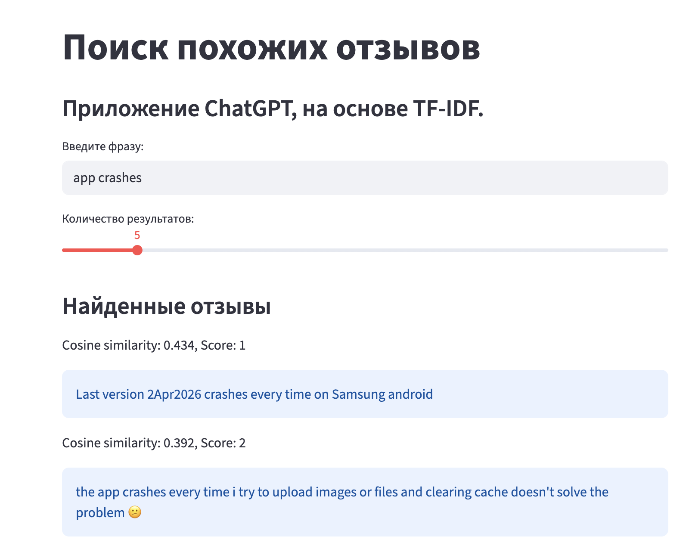

# Sentiment and Discourse Analysis of ChatGPT App Reviews

## Краткое описание

Данный проект посвящён анализу пользовательских отзывов приложения ChatGPT в Google Play с целью выявления лексико-семантических и дискурсивных различий между положительными и отрицательными отзывами, а также с целью автоматического извлечения потребностей пользователей из отрицательных отзывов.

Ссылка на приложение: https://play.google.com/store/apps/details?id=com.openai.chatgpt&hl=en_GB

Анализ выполнен без использования методов машинного обучения, с применением методов корпусной лингвистики и rule-based подхода.

---

## Основные исследовательские вопросы

- Чем отличаются лексические паттерны положительных и отрицательных отзывов?
- Какие темы доминируют в негативных отзывах?

---

## Данные

Корпус состоит из 50 000 пользовательских отзывов приложения ChatGPT, собранных из Google Play.
Максимальная длина отзыва 500 символов.
Из 50 000 отзывов только 20 845 на английском языке, сдедующие по популярности языки: Somali 7628, Afrikaans 3951, Polish 2583, Romanian 1839.
В корпусе есть следующие записи: reviewId, userName, userImage, content, score, thumbsUpCount,reviewCreatedVersion, at,replyContent,repliedAt,appVersion. thumbsUpCount интересная запись которая влияет на важность отзыва для других пользователей.
Для данного исследования мы будем использовать content, score.

Файл: chatgpt_reviews_raw.csv

---

### Наблюдения:

- корпус не сбалансирован, оценок 4-5 намного больше чем оценок 1-2. 1-2: 4 901 vs 4-5: 42 946, а для английского языка: 1-2: 2757 vs
4-5: 17117

---

## Балансировка данных

Для корректного сравнения корпус был сбалансирован.

В анализ включены:

- негативные отзывы (1–2)  
- положительные отзывы (4–5), случайно отобранные 

Количество отзывов в обеих группах одинаково и определяется размером меньшего класса.

Файл: chatgpt_reviews_clean_balanced.csv

---

## Очистка и фильтрация данных

Пользовательские отзывы содержат значительное количество шума.

В рамках исследования были удалены:

- дубликаты  
- пустые записи  
- слишком короткие тексты (менее 20 символов)  
- нерелевантные записи (например, только эмодзи)  

Дополнительно:
- выполнена автоматическая фильтрация языка  
- в анализ включены только англоязычные отзывы  

## Распределение оценок

После сбора, очистки и балансировки данных получено следующее распределение: 1-2: 2 310, 4-5: 2 310
Отзывы с оценкой 3 в исследование не вошли.
---

## Предобработка текста

Предобработка выполнялась с использованием Python-библиотек:

- NLTK  
- regex  
- langdetect  

Она включала:

- токенизацию  
- приведение текста к нижнему регистру  
- удаление пунктуации  
- удаление стоп-слов  
- лемматизацию  

---

#### Леммы  
Используются для снижения вариативности словоформ.

#### Биграммы  
Используются для выявления устойчивых словосочетаний.

Примеры:
- "very helpful"  
- "does not work"  
- "wrong answer"  
- "great app"  

---

### Статистический анализ

Для анализа использовались:

- частотный анализ  

---

## Семантическая классификация (rule-based)

Биграммы и ключевые слова распределялись по категориям.

### Категории:

- **Positive evaluation**  
- **Negative evaluation**  
- **Accuracy issues**  
- **Technical problems**  
- **Subscription / pricing**  

---

## Анализ результатов

Анализ включает:

- сравнение positive и negative отзывов  
- частотный анализ лексики  
- анализ биграмм  
- сравнение длины отзывов  

---

## Основные результаты

Анализ показывает, что:

- Положительные отзывы:
  - более короткие 
  - менее детализированные

- Отрицательные отзывы:
  - более длинные  
  - содержат описание проблем  
  - чаще включают аргументацию  

- Основные темы негативных отзывов:
  - ошибки в ответах  
  - технические проблемы  
  - ограничения и подписка  

---

## Ограничения исследования

- не используются методы машинного обучения  
- классификация основана на словарях  
- возможны ошибки определения языка  
- анализ ограничен одним приложением  

---

## Используемые инструменты

- Python  
- NLTK  
- pandas  
- matplotlib  
- regex  
- langdetect  

---

## Заключение

Проект демонстрирует, что методы корпусной лингвистики позволяют выявлять значимые различия в пользовательских отзывах без применения машинного обучения.

Дополнительно выявлено:
- выраженное доминирование положительных отзывов  
- поляризация пользовательских оценок  

---

## Возможные улучшения

- применение методов машинного обучения  
- автоматическая классификация отзывов  
- расширение корпуса  
- анализ динамики отзывов во времени  